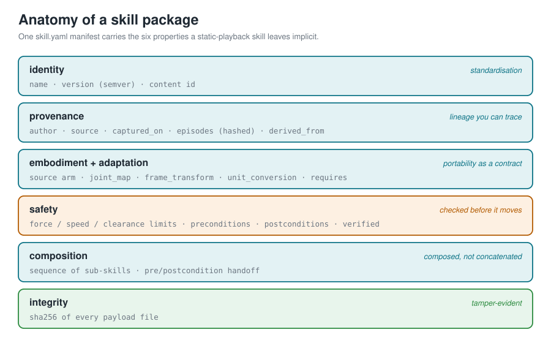
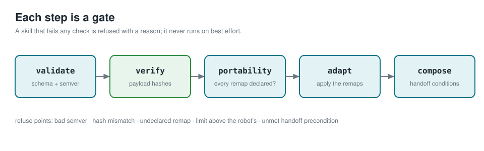

# skill-package-spec

**A versioned, checkable package format for robot skills.** The `.whl` and `pip check` for one-tap skills, not the skill and not the marketplace.

An August 2026 survey of commercial robot-skill marketplaces notes that they already ship one-tap skills, but only as **static playback**. That leaves six properties open: adaptation, cross-embodiment portability, provenance, safety verification, composition, and standardisation. This repo does not build a marketplace or a learning system. It ships a concrete manifest format plus reference tooling that makes those six properties **explicit in the package and checkable by a command**.



*One `skill.yaml` manifest carries all six properties a static-playback skill leaves implicit.*

## What this ships

- A **strict, versioned `skill.yaml` schema** (standardisation) with a validator that names the offending field.
- A **content id and per-payload sha256 integrity map** (provenance) so a skill has a stable identity and tampering is caught.
- A **declared adaptation contract** and an `adapt()` that remaps a skill onto another arm or refuses and names the missing mapping (portability, not silent playback).
- A **safety block** with force/speed/clearance limits and a safe precondition/postcondition language, and a verifier that refuses a skill whose limits exceed the target robot's or whose preconditions are false.
- A **composition block** whose sub-skill handoffs are checked: step N's postconditions must establish step N+1's preconditions.
- A **reference CLI and library** that run all of the above today, with no robot.

## What this is not

It is not a marketplace, not a policy or a learner, and not a runtime. It carries no images or model weights. It is the envelope and the checks; the skill inside is yours.

## Install

```
pip install git+https://github.com/megazron/skill-package-spec
```

Or clone and run from source with `PYTHONPATH=src`.

## Quickstart

```
skillpkg init my_skill                 # scaffold a manifest
skillpkg validate my_skill             # schema + semver
skillpkg verify  my_skill              # recompute payload hashes
skillpkg portability my_skill --target other_arm.yaml
skillpkg adapt   my_skill --target other_arm.yaml -o my_skill_ported
skillpkg compose pick_and_place --registry ./registry
skillpkg pack my_skill -o my_skill.skill
skillpkg selftest
```

The bundled example walks all six properties end to end, including the deliberate failures:

```
python3 examples/run_example.py
```



*Every check is a gate. A skill that fails one is refused with a reason; it never runs on best effort.*

## The manifest

```yaml
schema_version: 1
name: pick_cube
version: 1.0.0                     # semver, validated
description: Pick a cube from the table with a parallel gripper.

provenance:                       # where it came from, and its lineage
  author: megazron
  created: '2026-08-21'
  source: recorded                # recorded | learned | authored | composed
  captured_on: gen3_left          # must match the embodiment below
  episodes:
    - {id: ep_2026_08_21_014, sha256: 0000...}
  derived_from: []                # parent skill ids

embodiment:                       # the arm it was captured on
  name: gen3_left
  dof: 7
  joint_names: [joint_1, ..., joint_7]
  ee_frame: tool_frame
  gripper: robotiq_2f85
  control_mode: position
  units: {angle: rad, length: m}

adaptation:                       # how to run it elsewhere -- a contract
  joint_map: {}                   # source_joint -> target_joint
  frame_transform: {}             # e.g. {ee_frame: tool0}
  unit_conversion: {}             # e.g. {angle: rad->deg}
  requires: []                    # remaps that MUST be provided to port

safety:
  max_force_n: 20.0
  max_speed_mps: 0.25
  min_clearance_m: 0.12
  preconditions:  [gripper_open and cube_visible and table_clearance_m > 0.12]
  postconditions: [cube_grasped]
  verified: {tool: skillpkg, when: '2026-08-22', result: pass}

payload:   [trajectory.csv]       # the actual recorded motion
integrity: {}                     # sha256 per payload, filled on save
```

## The six properties, one at a time

**Standardisation.** `skillpkg validate` fails on a bad semver, a missing provenance field, a `joint_names` list that does not match `dof`, or a precondition that does not parse. A pull request that does not validate fails CI.

**Provenance and integrity.** The package `id` is a content hash over the manifest plus the payload integrity map, so the same skill always hashes the same way and any change moves it. `skillpkg verify` recomputes every payload sha256 and fails on a mismatch. `provenance.derived_from` records the parent ids, so lineage is walkable.

**Portability.** Portability is a declared contract, not a hope. `skillpkg portability my_skill --target other.yaml` refuses if the target's joints, units or end-effector frame differ and the manifest does not declare the remap. Fill in `adaptation` and it passes. This is the concrete line between static playback and a portable skill.

**Adaptation.** `skillpkg adapt` applies the declared joint map, frame transform and unit conversion, writes a new package with a bumped version and the parent id in `derived_from`, or refuses and names the missing mapping. It never guesses.

**Safety verification.** `skillpkg verify-safety --robot robot.yaml --world world.yaml` refuses a skill that assumes a force, speed or clearance the target robot cannot honour, and refuses to green-light one whose preconditions are false in the given world. Conditions are evaluated by a whitelisted `ast` parser: no calls, no attribute access, no imports.

**Composition.** A composed skill lists sub-skills by reference. `skillpkg compose --registry ./registry` resolves each and checks the handoff: step N's postconditions must include every precondition step N+1 needs. A gap is a failure with the exact missing condition, so composed skills are validated, not just concatenated.

## Origin

Extracted alongside a set of engineering toolkits from an MSc project, "Multimodal control of a wearable dual-arm robotic system for assisted object manipulation" (Imperial College London, 2026): <https://github.com/megazron/Multimodal-control-of-a-wearable-dual-arm-robotic-system-for-assisted-object-manipulation>. The provenance, single-source-of-truth and safety-gating discipline here come straight from that work; see the sibling repos [twin-truth](https://github.com/megazron/twin-truth) and [robobench-harness](https://github.com/megazron/robobench-harness).

## Limitations

The format and checks are real and runnable; the hard parts they make *checkable* are not thereby *solved*. Adaptation applies declared remaps but does not learn one; the safety verifier checks declared limits and symbolic preconditions, not dynamics; composition checks symbolic handoffs, not physical feasibility. It is the contract and the gate, which is what was missing.

## License

MIT, see [LICENSE](LICENSE).
